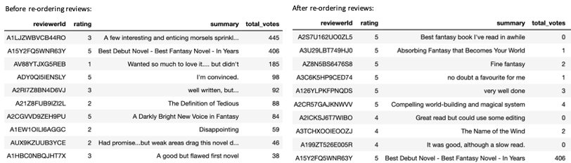

# General Assembly Data Science Capstone Project - Book Review Recommender

The purpose of this project was to build a book review recommender system, a system that recommends books to users and orders the reviews shown for each book recommendation in order of the reviewers most similar to the user. 

## Background and Problem Statement
When reading book reviews before purchasing a book, I often find myself wondering how much weight I should give the reviews. Was the reviewer similar to me and if their experience therefore would be similar to mine? I also never really read past the first 5 reviews, which are usually ranked by reviewer ranking or the number of likes. This gave me the idea to build a book review recommender system where I would first build a book recommender system and use this information to find the optimal order the reviews should appear in for every user and their recommended books, where the reviews are in order of the most similar reviewers to them. 

While this project would just consider books, this could extend to other products where the experience vs the functionality of the product would be more important. Given the overwhelming number of options for each product with the rise of e-commerce, more and more customers are starting to put increasing weight on reviews. Currently Amazon and Goodreads order their reviews by the reviewer ranking or the number of likes/helpful votes a post gets but this is not personalised to users and in the age of recommender systems, feels fitting that it should be the next step. Therefore, this feature could be an interesting addition and actually is a requested feature on GoodReads currently. 

## Data Accquring & Cleaning
Files: `data_cleaning` & `connecting_to_gcloud`

I am using the the [datasets provided by Julian McAuley and his team at USCD](http://jmcauley.ucsd.edu/data/amazon/), in particular the 2014 5-core book review dataset and the book metadata. 

The data was presented in large JSON files that I processed and cleaned chunkwise, given the size of the files and capablities of my laptop, before storing them as CSV files. The cleaning processed involved disregarding any incorrect rows with large HTML code from webscrapping, reengineering a few columns for better data storage and so on, which I have documented in the `data_cleaning` notebook. 

I had initially planned to upload these large CSV files to a Postgres database on GCloud to query from Jupyter Notebooks. But I ended up condensing the dataset and it made more sense to leave them as CSV files locally. However, I did upload the process of connecting to GCloud in the `connecting_to_gcloud` notebook. The condensed dataset had ~270k rows with all users and books that had atleast 50 reviews.  

## EDA
Files:`eda_book_review` 

I have gone through all of my findings in EDA of the datasets in the notebook `eda_book_review` notebook, but here are the main takeaways:
- The reviews were very skewed to the positive side with mainly 4 or 5 star ratings. 
- Negative reviews tend to get more attention as the avg number of total votes (likes) per rating category is the highest for 1 star and 2 star reveiews. This could push negative reviews unfairly to the top. 
- Look over the years, from 2000 to 2014, reviewers seem to have gotten more critical over the years with the avg rating dropped from ~4.25 to ~3.9. Interestingly, there is a large drop in 2007/2008, around the time of the financial crash, maybe to signify that the emotional toll from the economic collapse split over into how critical the reviewers were? 
- Not all of the books had metadata and even the books that did, some of information was vague, broad and not complete. E.g. most books had the tag 'Literature & Fiction' which made it hard to distiguish books well enough from one another. This is especially when trying to compare the results of the recommender system. 

## Picking the best algorithm and Gridsearching (Hypertuning)
Files: `testing_surprise_algos`, `baselineonly_gridsearch`, `knnbaseline_gridsearch` and `svd_gridsearch`

The [Surprise library](https://surprise.readthedocs.io/en/stable/index.html), a Python scikit, comes with a large of recommender system algorithms and I wanted to test all of the algorithms to find the best few, in terms of minimum RMSE, to gridsearch and hypertune even further. I used code from [this notebook](https://github.com/susanli2016/Machine-Learning-with-Python/blob/master/Building%20Recommender%20System%20with%20Surprise.ipynb) to iteratively cross validate all of the algorfirst cross validated all the algorithms, the code for this is in the notebook `testing_surprise_algos`. 

I picked BaselineOnly, SVD (picked this over SVD++ due to fit time) and KNNBaseline to hypertune with gridsearch further to obtain best RMSE score possible - BaselineOnly had the best score after gridsearching at 0.85279 (vs SVD at 0.8579 and KNNBaseline 0.8920). The code for gridsearching the three algos are in the notebooks `baselineonly_gridsearch`, `knnbaseline_gridsearch` and `svd_gridsearch`.

## Recommender systems
Files: `basic_rec_system`, `baseline_only_rec_system`, `svd_and_knn_rec_systems` and `recommender_functions.py`

### Impact of the model 
We can use the RMSE score to assess how well the model is doing in terms of recommending books. However, measuring if reordering the reviews based on user similarities is helpful the user or not is a lot harder as I would need customers to tell me if this reordering is helpful or not. But it was interesting to see if the model had any massive impact, so I came up with three metrics to try to assess this:

  1) rating difference: difference sum of the first 10 reviews before and after reordering, as most customers never read past the first 10 reviews. 
  2) rank difference: difference in the sum of the product of rating and rank the review is shows before and after reordering
  3) Pearson correlation of the ranks before and after (essentially Spearman correlation of the ratings before and after)

### Models implemented: 
- Basic recommender system (`basic_rec_system`)
- BaselineOnly recommender system (`baseline_only_rec_system`) - Best RMSE score at 0.85279
- SVD and KNNBaseline recommender systems (`svd_and_knn_rec_systems`)

For all the models, the process involved first building the most accurate prediction matrix possible(rows = users & columns = books) to have a complete set of estimated predictions for all books by all users. We can do this by minimising the RMSE score from known ratings. Then we can use this matrix to get the top N (in our case 10) recomendations for every user and calculate user similairities (cosine similarity). For each user and recommended book, we can use the user similarities to reorder the reviews and assess the impact of doing so using the three metrics defined above. To make the code more efficient and compact, I defined the functions to do these jobs in the script `recommender_functions.py`, 

### Recommender_functions.py script 

Functions 
- `get_top_10`: Get the top 10 book recommendations for every user. I decided to chose the top 5 books and randomly sample 5 books from the next 10 books to improve the coverage ratio. 
- `calculate_coverage`: Calculates the coverage ratio, i.e. what proportion of all available books are being recommended, a measure to check if the algorithm is only recommending the most popular books to everyone
- `precision_recall_at_k`: Code mainly from the [Surprise documentation](https://surprise.readthedocs.io/en/stable/index.html) that calculates the precision and recall scores
- `calculate_impact`: Calculates the 3 different ways of acessing the impact of reordering 
    the reviews according to user similarities for each user-book pair, rating difference, rank difference, Pearson correlation of the ranks before and after.
- `get_categories` : Returns top 10 categories previously read by the user and top 10 categories of the recommended books. A visual way to make sense of results of recommendation algo
- `review_reorder_example`:Returns a visual example of how recordering the reviews would look like i.e. returns the order of reviews before and after calculating the user similarities, along with the 3 impact measurement metrics for a chosen user-item pair.

## Results:
All in all, the project was a great way to learn more about recommender systems. I thought I would run through an example here to visualise reordering of reviews and impact of the model. I have decided to pick a random user, 'A3UDYY6L2NH3JS' and a book from their recommended list, asin: 0575081384 & book name: The KingKiller Chronicles, The Name of the Wind. The image below shows what order the reviews would currently appear (in order of likes) on the right and on the left, the order the reviews should appear if ordered according to user similarity. This example is a great demonstration of a case where the user reading the reviews currently would have mixed thoughts on buying the book but according to reviewers similar to him, they would love it. 

It was quite hard to sense the recommendations or the reviewer similarities through observing the categories of the books as the data was firstly incomplete and the book tags were very broad and vague. The avgs of the three metric defined above are as follows:

- Avg correlation of ranks: 0.51
  Does show that the reordering does cause a bit of jumbling of the order of the reviews

- Difference of weighted rating sums: 11.6 / abs value: 75. 1

- Difference of sum of top 10 ratings:  -1.34 / abs value:  1.91 

## Next Steps:
- Group the categories a bit better
- Use better meta dataset 
- try to include review text context analysis to improve the recommender system 
- neighbourhood models to use for cosine similarity rather than calculating using the whole user-item matrix 

