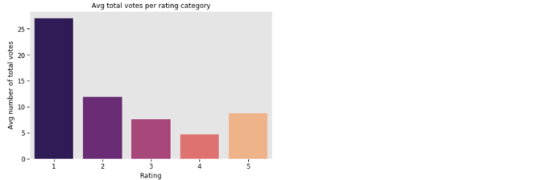
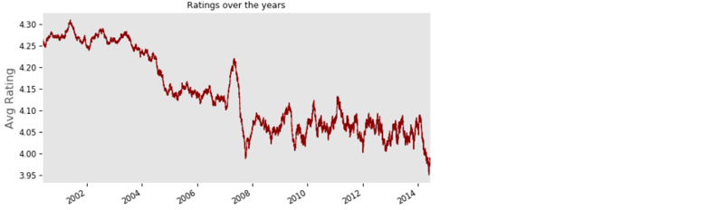

# General Assembly Data Science Capstone Project - Book Review Recommender

The purpose of this project was to build a book review recommender system, one that recommends books to users and orders the existing reviews for each book recommendation in order of the reviewers most similar to the user. 

## Background and Problem Statement
When reading book reviews before purchasing a book, I often find myself wondering how much weight I should give the reviews. How similar are the reviewers to me and therefore how much would their experience reflect my own? Reviews currently are ordered by the number of likes/helpful votes or reviewer ranking and in the age of recommender systems, it would be interesting to observe the effect of personalising the order of reviews too - this is currently a requested feature on GoodReads. 

While this project would just consider books, this could extend to other products where the experience vs the functionality of the product would be more important. 

## Data Accquring & Cleaning
Relevant files: `data_cleaning` & `connecting_to_gcloud`

I am using the [datasets provided by Julian McAuley and his team at USCD](http://jmcauley.ucsd.edu/data/amazon/), in particular the 2014 5-core book review dataset and the book metadata. 

- **Data cleaning**: The data was provided in large JSON files that I processed and cleaned chunkwise, given the size of the files and capablities of my laptop, before storing them as CSV files. The cleaning process, which included reengineering columns for better data analysis, cleaning messy book descriptions titles and so on, is documented in the `data_cleaning` notebook. 

- **GCloud**: I had initially planned to upload these large CSV files to a remote Postgres database on GCloud to query from my Jupyter Notebook. But I ended up condensing the dataset and it made more sense to leave the data as CSV files locally. However, I did upload the process of connecting to Postgres on GCloud in the `connecting_to_gcloud` notebook. 

The condensed dataset had ~270k rows, containing only the users and books with atleast 50 reviews.

## EDA
Relevant files:`eda_book_review` 

The `eda_book_review` notebook contains a detailed look into the book reviews, but here are 2 interesting takeaways:

- Negative reviews tend to get more attention as the avg number of total votes (likes) per rating category is the highest for 1 star and 2 star reveiews. This could push negative reviews unfairly to the top. 

- Reviewers have become harsher with their reviews from 2000 to 2014, as the avg rating dropped from ~4.25 to ~3.9. Interestingly, there is a large drop in the avg rating in 2007/2008, around the time of the financial crash...

Note: The metadata was incomplete and messy as not all of the books were contained in the metadata and for the books that did exist, some of information was vague and broad. For example, most books had the tag 'Literature & Fiction' which made it hard to distiguish books well enough from one another. This is especially apparent when trying to understand the results of the recommender system. 

## Picking the best algorithm and Gridsearching (Hypertuning)
Relevant files: `testing_surprise_algos`, `baselineonly_gridsearch`, `knnbaseline_gridsearch` and `svd_gridsearch`

The [Surprise library](https://surprise.readthedocs.io/en/stable/index.html), a Python scikit, comes with a large suite of recommender system algorithms. I tested all of them to find the best 3, in terms of minimum RMSE, to gridsearch and hypertune even further. I used code from [this notebook](https://github.com/susanli2016/Machine-Learning-with-Python/blob/master/Building%20Recommender%20System%20with%20Surprise.ipynb) to iteratively cross validate all of the algorithms, which is documented in the notebook `testing_surprise_algos`. 

As the image below shows, I picked BaselineOnly, SVD (picked this over SVD++ due to fit time) and KNNBaseline to hypertune with gridsearch further to obtain best RMSE score possible - BaselineOnly had the best score after gridsearching at 0.85279 (vs SVD at 0.8579 and KNNBaseline 0.8920). The code for gridsearching the three algos are in the notebooks `baselineonly_gridsearch`, `knnbaseline_gridsearch` and `svd_gridsearch`.

## Recommender systems
Files: `basic_rec_system`, `baseline_only_rec_system`, `svd_and_knn_rec_systems` and `recommender_functions.py`

I implemented the following 4 recommender system models: 
- **Basic recommender system** (`basic_rec_system`)
- **BaselineOnly recommender system** (`baseline_only_rec_system`) - Best RMSE score at 0.85279
- **SVD and KNNBaseline recommender systems** (`svd_and_knn_rec_systems`)

For all the models, the process involved first building the most accurate prediction matrix possible (rows = users & columns = books) to have a complete set of estimated predictions for all books by all users. We can do this by minimising the RMSE score from known ratings. Then we can use this matrix to get the top N (in our case 10) recomendations for every user and calculate user similairities (cosine similarity). 

For each user and recommended book, we can use the user similarities to reorder the reviews and assess the impact of doing so using the three metrics defined below. To make the code more efficient and compact, I defined the functions to do these jobs in the script `recommender_functions.py`, 

### Measuring the impact of the model 
We can use the RMSE score to assess how well the model is doing in terms of recommending books. However, measuring if re-ordering the reviews based on user similarities is helpful the user or not is a lot harder as I would need customers to tell me if this re-ordering is helpful or not. But it was interesting to see if the model had any noticeable impact, so I came up with three metrics to try to assess this:

  1) rating difference: difference sum of the first 10 reviews before and after re-ordering, as most customers never read past the first 10 reviews. 
  2) rank difference: difference in the sum of the product of rating and the rank of the review before and after re-ordering
  3) Pearson correlation of the ranks before and after (essentially Spearman correlation of the ratings before and after)

### Functions in the recommender_functions.py script 

Functions 
- `get_top_10`: Get the top 10 book recommendations for every user. I decided to chose the top 5 books and randomly sample 5 books from the next 10 books to improve the coverage ratio. 
- `calculate_coverage`: Calculates the coverage ratio, i.e. what proportion of all available books are being recommended, a measure to check if the model is only recommending the most popular books to everyone
- `precision_recall_at_k`: Code mainly from the [Surprise documentation](https://surprise.readthedocs.io/en/stable/index.html) that calculates the precision and recall scores
- `calculate_impact`: Calculates the 3 different ways of acessing the impact of reordering as discussed above
- `get_categories` : Returns top 10 categories previously read by the user and top 10 categories of the recommended books. A visual way to make sense of results of recommendation model
- `review_reorder_example`: Returns a visual example of how re-ordering the reviews would look like, i.e. returns the order of reviews before and after calculating the user similarities, along with the categories previously read by the top 10 reviewers before and after, to assess if there is any noticeable difference. 

## Results:
The example below is a great case as to why reviewer similarity should play a part in ordering reviews.

I have decided to pick a random user, 'A3UDYY6L2NH3JS' and a book from their recommended list, asin: 0575081384 & book name: The KingKiller Chronicles, The Name of the Wind. The image below shows what order the reviews would currently appear (in order of the number of likes) on the right and on the left, the order the reviews should appear if ordered according to user similarity. 

The reviews on the right are more mixed but on the left, where the top 10 reviewers most to our user, unanimously enjoyed the book and gave it 5 stars. Looking at the categories of books previously read by the reviewers, the ones of the left have read a higher percent of Sci-Fi Fantasy fiction, which is one of the top read categories of our user and the book category. 

Assessing the overall impact of re-ordering the reviews, as I mentioned before, is hard to measure or make sense of but here are the overall averages of the 3 metrics I defined earlier: 

- Avg correlation of ranks - 0.48: Does show that the re-ordering does move the reviews around enough for there to be low correlation, poses the question if most liked reviews are necessary useful to everyone. 

- Difference of weighted rating sums - 11.6 / abs value 75.1

- Difference of sum of top 10 ratings -  -1.34 / abs value 1.91: Re-ordering the reviews would mean the top 10 reviews would on average have 1.34 stars more, which could be beneficial for retailers. 

## Next Steps:
All in all, the project was a great way to learn more about recommender systems. Here are few ideas I have to take it further and improve the model: 
- Gather better metadata to be able to understand and assess the impact of re-ordering more accurately
- Use a bigger and more comprehensive dataset to test the model on AWS
- Include Review Text Context analysis to potentially improve rating predictions as detailed in [this paper](https://www.ncbi.nlm.nih.gov/pmc/articles/PMC4735905/) 
- Define better metrics to measure the helpfulness and impact of personalising reviews
 
